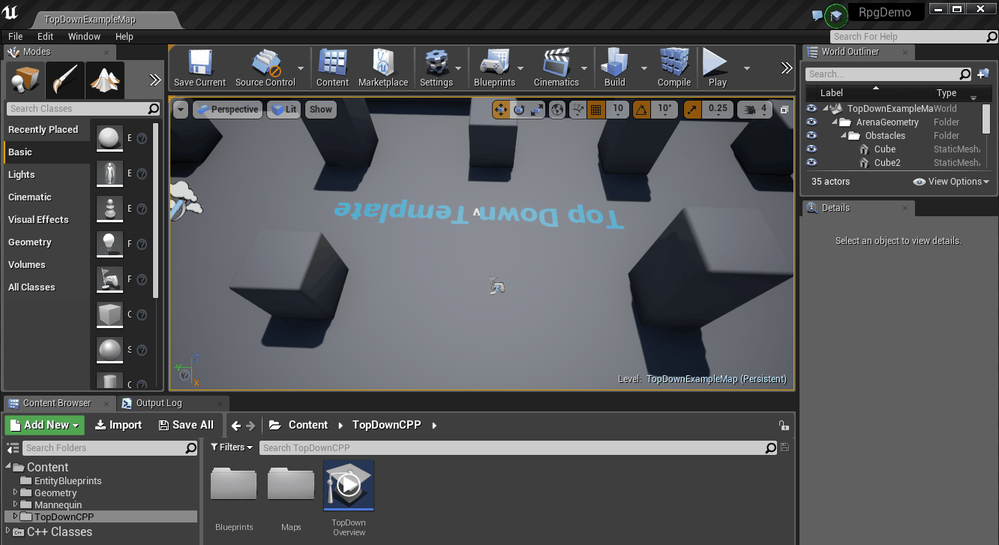
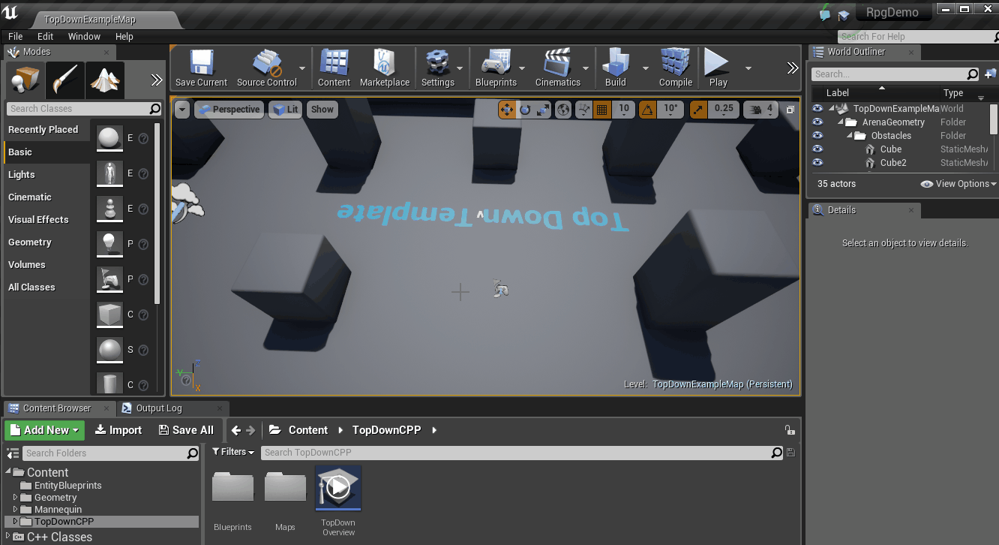

# Setting up Unreal as a SpatialOS worker

Here is what is required to set up Unreal as a SpatialOS worker:

* [Directory structure](#directory-structure)
* [The SpatialOS object](#the-spatialos-object)
* [Game instances](#game-instances)
* [Setting up a connection](#setting-up-a-connection)
* [Processing operations](#processing-operations)

## Directory structure

For information about the required directory structure (including the mandatory `worker.json` file which
contains most of the configuration), see the [Unreal directory structure](../reference/unreal-worker-structure.md)
page.

## The SpatialOS object

Use the SpatialOS object to set up a worker and manage its connection. You can also use it to set up callbacks
to handle both successful and failed attempts to connect to SpatialOS as well as disconnection callbacks.

## Game instances

> This step is not necessary, however it is advised as it simplifies the setup of a worker.

We recommend delegating the ownership of the SpatialOS object to an object with a lifetime that
matches that of your game (although it can in theory be owned by any class in your project). For example,
the class `UGameInstance` will work well.

To create a new game instance:

0. Create a new child class of the `UGameInstance` in your Unreal Enigine 4 project using Unreal Engine 4 editor:

    

0. Once created, you need to specify your new game instance in your DefaultEngine.ini file. This can be done either by manually adding the line
`GameInstanceClass=/Script/YourGameInstanceName` under the `[/Script/EngineSettings.GameMapsSettings]` section or using the Unreal Engine 4 editor:

    

For examples on how to set up the `SpatialOS` object with a `UGameInstance`, refer to the
[UnrealStarterProject game instance](https://github.com/spatialos/UnrealStarterProject/blob/master/workers/unreal/Game/Source/StarterProject/StarterProjectGameInstance.h).

For further documentation on `UGameInstance` and its usage, refer to the [GameInstance tutorial](https://wiki.unrealengine.com/Game_Instance,_Custom_Game_Instance_For_Inter-Level_Persistent_Data_Storage)
and [UGameInstance API reference](https://docs.unrealengine.com/latest/INT/API/Runtime/Engine/Engine/UGameInstance/index.html)

## Setting up a connection

### Set up the OnConnected, OnConnectionFailed and OnDisconnected callbacks

Before you create the connection, register three callbacks on the `SpatialOS` object which
allow you to perform game specific logic as a response to successful/unsuccessful connections as well as disconnection events.
For example:

```cpp
// Get the SpatialOS object from the GameInstance.
auto SpatialOS = GameInstance->GetSpatialOS();
if (SpatialOS != nullptr)
{
    SpatialOS->OnConnectedDelegate.AddDynamic(...);
    SpatialOS->OnConnectionFailedDelegate.AddDynamic(...);
    SpatialOS->OnDisconnectedDelegate.AddDynamic(...);
}
```
> * In the code section above, the `GameInstance` is of the same type as your custom game instance such that
access to the function `GetSpatialOS()` is available.
* The `SpatialOS` object uses delegates for callback registration. For more info on how to use such delegates,
refer to the [delegate documentation](https://docs.unrealengine.com/latest/INT/Programming/UnrealArchitecture/Delegates/).
Further examples can also be found in the [Unreal Starter Project](https://github.com/spatialos/UnrealStarterProject).


### Creating the connection

To create a connection:

```cpp
auto SpatialOS = GameInstance->GetSpatialOS();

if (SpatialOS != nullptr)
{
    auto WorkerConfig = FSOSWorkerConfigurationData();

    // populate the worker configuration

    // ...

    SpatialOS->ApplyConfiguration(WorkerConfig);
    SpatialOS->Connect();
}
```
> In the code section above, the `GameInstance` is of the same type as your
custom game instance such that access to the function `GetSpatialOS()` is available.


Use the `FSOSWorkerConfigurationData` object to specify the configuration of your worker, including
properties related to debugging, networking and assembly configuration. For more information, see the in-code
documentation for `FSOSWorkerConfigurationData`.

For examples, see the [Unreal Starter Project](https://github.com/spatialos/UnrealStarterProject).

### Disconnecting a worker

The `SpatialOS` object is also responsible for initiating the disconnection process and removing all callbacks
registered on the `SpatialOS` object. The example below triggers the disconnection and removes the registered callbacks
`OnSpatialOsConnected`, `OnSpatialOsFailedToConnect` and `OnSpatialOsDisconnect` which are member functions of an arbitrary class `AClassName`:

```cpp
// Get the SpatialOS object from the GameInstance.
auto SpatialOS = GameInstance->GetSpatialOS();
if (SpatialOS != nullptr)
{
    SpatialOS->Disconnect();

    SpatialOS->OnConnectedDelegate.RemoveDynamic(...);
    SpatialOS->OnConnectionFailedDelegate.RemoveDynamic(...);
    SpatialOS->OnDisconnectedDelegate.RemoveDynamic(...);
}
```
> 
* In the code section above, the `GameInstance` is of the same type as your custom game instance such that
access to the function `GetSpatialOS()` is available.
* The `SpatialOS` object uses Unreal Engine 4 delegates for callback registration. For more info on how to use such delegates,
refer to the [Unreal Engine 4 delegate documentation](https://docs.unrealengine.com/latest/INT/Programming/UnrealArchitecture/Delegates/).
Examples can also be found in the [Unreal Starter Project](https://github.com/spatialos/UnrealStarterProject).


## Processing operations

You can use the `SpatialOS` object to process incoming [operations (SpatialOS documentation)](https://docs.improbable.io/reference/12.2/shared/design/operations) from the connection. 
This should ideally be done at a relatively frequent rate such as once per frame.

```cpp
// Get the SpatialOS object from the GameInstance.
auto SpatialOS = GameInstance->GetSpatialOS();
if (SpatialOS != nullptr)
{
    SpatialOS->ProcessOps();
}
```
> 
* In the code section above, the `GameInstance` is of the same type as your custom game instance such that
access to the function `GetSpatialOS()` is available.
* We recommend calling `ProcessOps()` in the update function of your active game mode. For examples,
refer to the [Unreal Starter Project](https://github.com/spatialos/UnrealStarterProject).
* `ProcessOps()` gets a list of operations from the lower level worker connection API and and passes 
them to the dispatcher for processing. For more information about worker connection API, 
please see [`worker::Connection` class (SpatialOS documentation)](https://docs.improbable.io/reference/12.2/cppsdk/api-reference#worker-connection-class).


If components are set to use [automatic state replication](../interact-with-world/interact-components.md#automatic-state-replication), 
you need to add `USpatialOSComponentUpdater->UpdateComponents(EntityRegistry, DeltaTime)` in every tick 
after `USpatialOS->ProcessOps()` is called.
```cpp
// Get the SpatialOS object from the GameInstance.
auto SpatialOS = GameInstance->GetSpatialOS();
if (SpatialOS != nullptr)
{
    SpatialOS->ProcessOps();
	...
	USpatialOSComponentUpdater->UpdateComponents(EntityRegistry, DeltaTime);
}
```
`USpatialOSComponentUpdater->UpdateComponents(EntityRegistry, DeltaTime)` will replicate the changes of components of every entity registered in EntityRegistry, except those entities which are destroyed or marked as `PendingToBeKilled`.