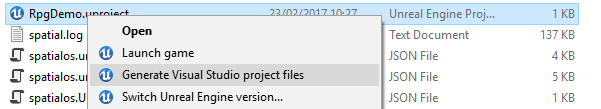

# Building in Unreal

There are two ways you can build Unreal workers after you've made changes to them:

* [build the project using the `spatial` command-line](#build-using-spatial)
* [build the project from Visual Studio IDE](#build-from-visual-studio)

> **Note**: If you clean your Unreal project, building will rebuild Unreal Engine from source. This often takes
> **a few hours**. Just so you know!

## Build using spatial

You can build Unreal workers using the `spatial` command-line tool, without having to go through an
IDE.

To do this, from the root folder of your SpatialOS project:

* To build for a local deployment, run `spatial worker build --target=local`
* To build for a *cloud* deployment, run `spatial worker build --target=cloud`

You can now run either a local or cloud deployment using the instructions from the
[Running your project](../develop/debug-and-iterate.md) page.

## Build from Visual Studio

You can build a worker directly from Visual Studio. To do this:

1. Navigate to the root folder of your SpatialOS project.
2. In this directory, open a terminal and run `spatial worker codegen`.
3. **If you haven't generated the Visual Studio project files for your worker yet**, right-click on
    your `.uproject` file and select "Generate Visual Studio project files":

    

    > You will need to repeat this step whenever you add or remove [schema (SpatialOS documentation)](https://docs.improbable.io/reference/12.2/shared/glossary#schema) files during development.
4. Open the Visual Studio project for your worker. This should have the same name as your `.uproject`
    but with the extension `.sln`. For example, `UnrealStarterProject.sln`.

    This will launch your worker project in Visual Studio.
5. Once Visual Studio has loaded, set your solution configuration and your solution platform to your desired target.
6. Build your project using the menu **Build > Build Solution**.

Once the build has succeeded, SpatialOS will package your worker. You can now run either a local or cloud deployment
using the instructions from the [Running your project](../develop/debug-and-iterate.md)
page.