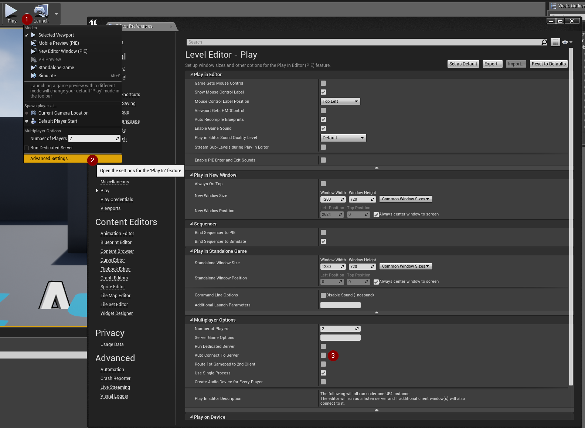
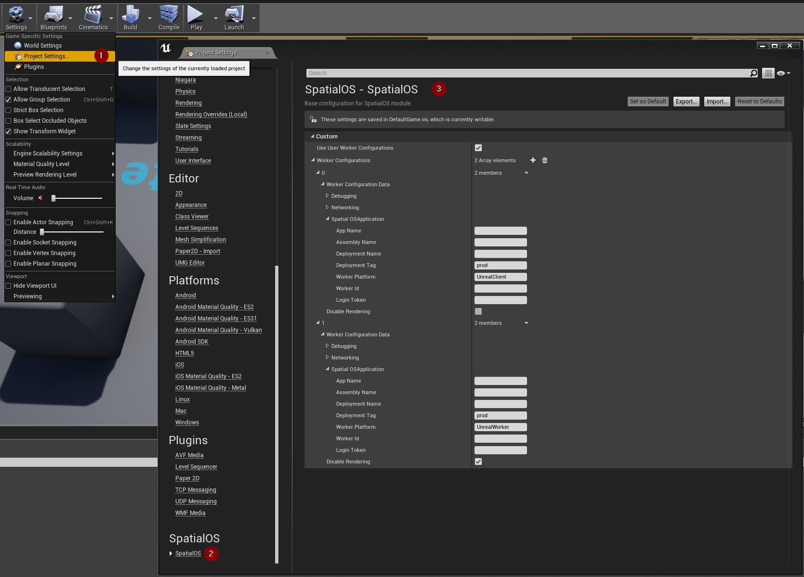

# Running workers from the Unreal editor

[UnrealClients (SpatialOS documentation)](https://docs.improbable.io/reference/12.2/shared/glossary#client-worker) and [UnrealWorkers (SpatialOS documentation)](https://docs.improbable.io/reference/12.2/shared/glossary#managed-worker-server-side-worker)
can be started and debugged from the Unreal Editor to connect to a running SpatialOS deployment. The following guide shows you how:

## Setup

> You need to follow these steps before you can
[connect workers and clients](#connect-workers-and-clients).

0. Enable the SpatialOS editor settings by loading the SpatialOS module in your `.uproject`:

    ```json
    "Modules": [
        {
            "Name": "UnrealStarterProject",
            "Type": "Runtime",
            "LoadingPhase": "Default",
            "AdditionalDependencies": [
                "AIModule",
                "Engine"
            ]
        },
        {
            "Name": "SpatialOS",
            "Type": "Runtime",
            "LoadingPhase": "Default"
        }
    ],
    ```

0. Turn off Unreal auto connect: In the **▷ Play** drop-down menu, select **Advanced Settings**.

    

    Make sure that 
    - **Run Dedicated Server** is disabled.
    - **Auto Connect To Server** is disabled. (Set the **Number of Players** option to a value higher than `1` to make this option editable.)
    - **Use Single Process** is enabled.

0. Open the **Project Settings** in Unreal Editor, scroll down to the **Improbable** section
and select **SpatialOS**.

    Set up the worker configurations you want to use when running workers from the Unreal Editor:

    

    > __Note__: You can set up multiple worker configuration instances if you want to run multiple worker instances at the same time.

0. Edit your code that performs the connection to SpatialOS so that it supplies a `WorldContext` struct to
the `ApplyWorkerConfiguration()` call:

    ```cpp
    void AStarterProjectGameMode::StartPlay()
    {
        AGameModeBase::StartPlay();

        auto SpatialOS = GetSpatialOS();
        if (SpatialOS != nullptr)
        {
            auto CurrentWorldContext = GetGameInstance()->GetWorldContext();
            if (CurrentWorldContext != nullptr)
            {
                SpatialOS->ApplyEditorWorkerConfiguration(*CurrentWorldContext);
            }
            else
            {
                SpatialOS->ApplyConfiguration(FSOSWorkerConfigurationData());
            }

            SpatialOS->Connect();
        }
    }
    ```

    This will override each of the workers' configurations with the settings specified in the Project Settings.
    The worker configuration settings are applied to the first worker instances started up based on the `PIEInstance` field of their respective `WorldContext`. 
    If there are more worker instances than worker configurations, no worker configuration is applied to the remaining worker instances.

0. Set up the number of worker instances to start: In the **▷ Play** drop-down menu, change the **Number of Players** to
specify how many Unreal workers or clients you want to start. 

    

    For example, if you want to launch one worker and one client:
    * Set the **Number of Players** to `2`
    * Have one **Worker Configuration** set up with `UnrealClient` specified in **SpatialOS Application > Worker Platform**
    * Have one **Worker Configuration** set up with `UnrealWorker` specified in **SpatialOS Application > Worker Platform**

## Connect workers and clients

0. Set up a launch configuration that waits for a manual worker and client. For instructions on how to do this,
see [Singleton workers (SpatialOS documentation)](https://docs.improbable.io/reference/12.2/shared/worker-configuration/loadbalancer-config#singleton-workers). Alternatively,
open `default_launch.json` in your project directory, and modify the `num_workers` field under
`load_balancing` to 0.
0. In a terminal, run a [local deployment (SpatialOS documentation)](https://docs.improbable.io/reference/12.2/shared/glossary#local-deployment) by
running [`spatial local launch` (SpatialOS documentation)](https://docs.improbable.io/reference/12.2/shared/spatial-cli/spatial-local-launch).
0. Press **▷ Play** to launch your workers and clients and connect to SpatialOS.

> __Note__: If your client automatically connects to SpatialOS on launch, make sure there is a short
delay in the client code or Blueprints to allow the worker to start up and initialise first.

## Deploying to the cloud

For information about deploying to the cloud, see [Deploying to the cloud (SpatialOS documentation)](https://docs.improbable.io/reference/12.2/shared/deploy/deploy-cloud).
