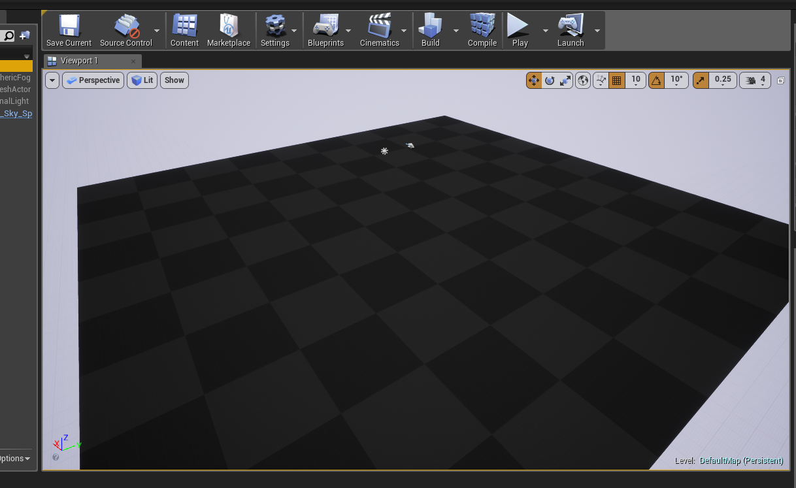
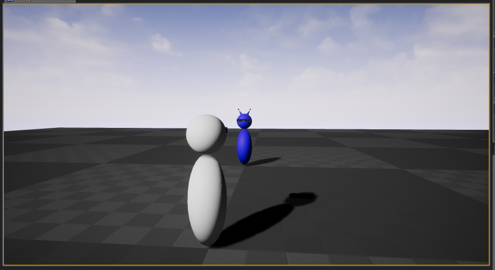
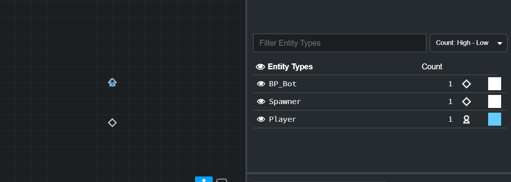
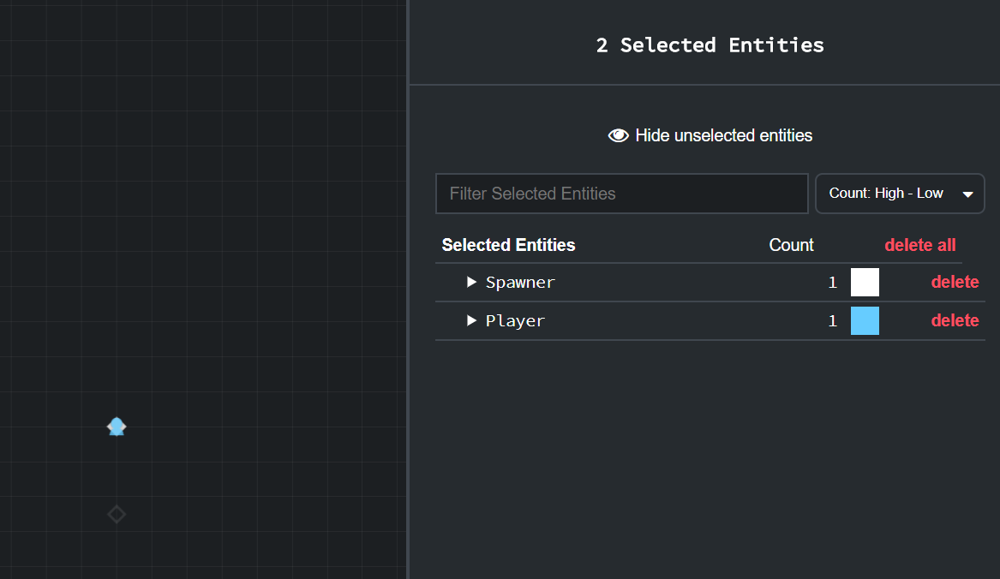
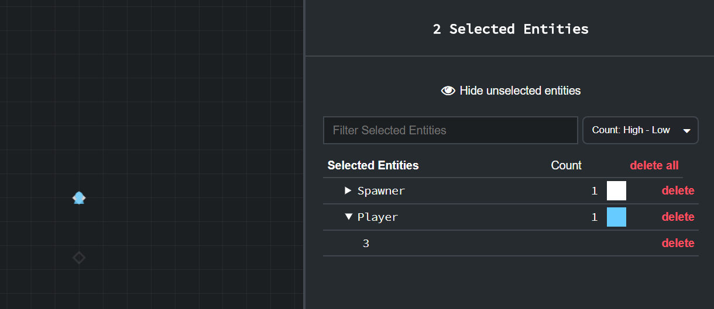
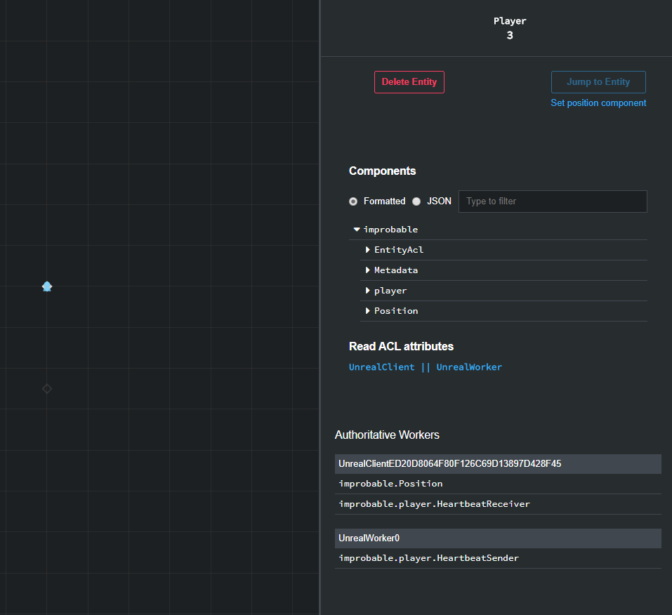
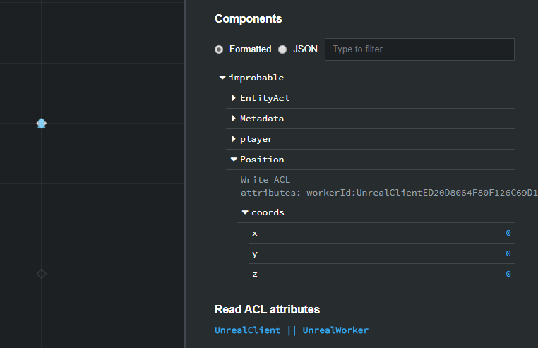

# Basics 1 - Setup

Welcome to the Unreal Basics Tutorial.

In this lesson you'll:

* **set up your machine** for development with SpatialOS and Unreal
* **get the project code**
* **run the project** locally
* **use the Inspector** to explore the world
* **learn about entities, components and workers** - the core concepts of SpatialOS

This first lesson is mostly background work you need to do before you can get going with development. Once your machine is
set up and the project is running, we'll use the project to explain the basic concepts of SpatialOS. So bear with us!

## 1. Set up your machine

To set up your machine for developing with SpatialOS, follow the [setup guide for Windows](../../get-started/setup/win.md), including the optional Unreal part. This sets up the `spatial` command-line tool, which you use to build, run, and deploy your game. You'll use it later in the lesson to build the game and run a local deployment.

At the moment, the SpatialOS Unreal SDK only works on Windows.

> **It's done when:** You run `spatial version` in a terminal, and see `'spatial' command-line tool version: <number>` (or `'spatial.exe' command-line tool version: <number>`) printed in your console output.

## 2. Set up the project

In this tutorial you'll develop on a variation of the [Unreal Starter Project](https://github.com/spatialos/UnrealStarterProject) that we've prepared.

This variation contains a pawn for the Player (replacing the cube) and a “bot” pawn.

### 2.1. Download the source code

Download and unzip <a href="https://github.com/spatialos/UnrealBasicsTutorial/archive/master.zip" data-track-link="Repository Zip Downloaded|product=Docs|repositoryName=Unreal-Basics-Tutorial" target="_blank">the source code</a>.

### 2.2. Check your setup

0. Open a terminal and navigate to the directory you just unzipped (the directory that contains `spatialos.json`).

0. Run `spatial diagnose`. This checks that you installed all the software you needed correctly.

0. If spatial diagnose finds errors with your setup, fix them.

> **It's done when:** You see `'spatial diagnose' succeeded` (or `'spatial.exe diagnose' succeeded`) printed in your console output.

### 2.3. Build the project

In same terminal window, run `spatial worker build --target=local`.

This builds the game. It can take a while, so you might want to go and get a cup of tea.

If it doesn't work first time, you can retry by running `spatial worker clean` then `spatial worker build` again.

> **It's done when:** You see `'spatial build' succeeded` (or `'spatial.exe build' succeeded`) printed in your console output.

### 2.4. Run the project locally

In the same terminal window as before, run a local deployment of the game by running `spatial local launch`. This can take a minute to get up and running.

> This command launches SpatialOS itself, locally. SpatialOS then starts up the 'workers' it needs to run the game. We'll explain more about what that means in a bit.

> **It's done when:** You see `SpatialOS ready. Access the inspector at http://localhost:21000/`inspector printed in your console output. However, the configuration of the project also launches one managed worker and you'll know it's ready when you see `The worker UnrealWorker0 registered with SpatialOS successfully`.

Sometimes, depending on the load on your machine, the starting of workers can time out. When that happens, you will see some error messages on your terminal but SpatialOS will keep trying starting new workers, so you can end up with `UnrealWorker5` instead of `UnrealWorker0`.

### 2.5. Connect a client

Now SpatialOS is running the server-side part of the game. But for you to connect to it and play, you need to run a client.

There are several ways to run a client, but the fastest one for local development is to run one from the Unreal Editor.

0. Locate the Unreal project file for your project. This can be found in `PROJECT_ROOT/workers/unreal/Game`

0. Right-click on your project's `.uproject` file and select **Switch Unreal Engine version**.

0. Switch engine versions to the source-built version you built previously.

0. Double-click on `StarterProject.uproject` to open the project in Unreal. You'll see a scene containing just a flat surface that is the ground. 

0. Click **Play ▶** and when it connects, you'll see some log messages. You'll be in control of a pawn that you can move using `WASD`, and you'll see a bot standing in front of you.

## 3. Open the Inspector

The [Inspector (SpatialOS documentation)](https://docs.improbable.io/reference/12.2/shared/glossary#inspector) is a web-based tool that you use to explore the internal state of a SpatialOS world. You'll use it right now to find out about the main SpatialOS concepts.

Open the Inspector at [`http://localhost:21000/inspector`](http://localhost:21000/inspector).

### 3.1. What you can see in the Inspector window

#### Entities

**Entities** are the basic building block of a SpatialOS world. Every _thing_ that has some kind of persistence or has data which needs to be replicated in different clients in your game world should be an [entity (SpatialOS documentation)](https://docs.improbable.io/reference/12.2/shared/glossary#entity).

Entities are made of components, which describe an entity's properties (like position, health, or waypoints).

The main area of the Inspector shows you a top-down, real-time view of the entities in your game world. This project contains three entities: your Player that was created when your client connected, a Spawner (you’ll learn about this later, but essentially it’s an entity that can create new entities like your player), and the standing bot.

The bottom-right list initially shows how many entities of each type there are in the current view of the Inspector. We'll look at this area in more detail shortly.

#### Workers

The top-right list shows the **workers** connected to SpatialOS.

Essentially, workers are just programs that can read from and modify the entities in the world you see in the Inspector.

In _this_ project, all the workers are **instances of Unreal**. There are two types:

* Unreal running in headless mode. These workers handle the server-side logic. In the list, `UnrealWorker0` is of this type.

* Unreal running as a client. There'll be one of these in the list for every player connected. At the moment, there's just one: yours (`UnrealClient` followed by a list of random characters).

The number next to each worker represents its **load**: a measure of how much work it is doing. SpatialOS uses this number to start and stop server-side workers as necessary.

The project is configured to start with one `UnrealWorker`; but if you expanded the game world, you'd need more. SpatialOS automatically allocates areas of the world to each `UnrealWorker`, and seamlessly stitches the world together between them according to several patterns that you can configure.

#### Components

As mentioned before, entities are made up of [components (SpatialOS documentation)](https://docs.improbable.io/reference/12.2/shared/glossary#component), and you can view these in the Inspector. To do so, select your player entity by left-clicking on it. Since there are two entities in the same position, you'll see that you selected both:

> Sometimes, in Chrome, there's an issue that means you can't select entities. To fix this, detach the Inspector tab from the Chrome window, and then reattach it (or, if you have the Inspector open in its own window, attach it to another window and then detach it again).

This view lists all the entities of each type that you've selected. To see the individual ones, expand the list:

You'll see there's one player entity (in this case the entity with ID `3`). Click the ID number to select the entity.

This view lists all the components of the entity, and which workers have authority over them (you'll learn about [authority (SpatialOS documentation)](https://docs.improbable.io/reference/12.2/shared/glossary#read-and-write-access-authority) in more detail later).

You can select a component to see the information it contains. Do so for the `Position` one and you'll see it has a set of coordinates `coords`, which in this case are (0,0,0).

Components are really what define an entity. They can be anything you like, but common examples might be health, or stats. _Every_ entity has a `Position` component that defines its location in the SpatialOS world.

### 3.2. (optional) Stop a worker

To see worker management in action, you can stop the worker running the game logic, and see how SpatialOS starts a new one - without any disruption to players at all. To try this:

1. Click the name `UnrealWorker0` in the list of workers. This shows details about that worker.

1. Click the red **Stop worker** button. This shows a confirmation dialog.

1. Click the **Stop worker** button.

SpatialOS stops the worker immediately. Just a few seconds later, the load-balancing algorithm kicks in, and it starts a new worker. Note that nothing at all happens in the game window - the client isn't even disconnected. Load-balancing is completely invisible to players.

## 4. Stop the game running

1. In Unreal, click the **Stop** button to stop your client.

1. In your terminal, stop the server side of the game by pressing Ctrl + C.

> There's a known issue where Ctrl + C sometimes doesn't properly stop all processes. See
[this forum post](https://forums.improbable.io/t/ctrl-c-not-stopping-spatial-local-deployment/2925) for fixes and
workarounds.

## Lesson summary

In this lesson you've set up the SpatialOS SDK on your machine, and run the project for the first time. You've also learned about some fundamental SpatialOS concepts: [entities (SpatialOS documentation)](https://docs.improbable.io/reference/12.2/shared/glossary#entity),
[components (SpatialOS documentation)](https://docs.improbable.io/reference/12.2/shared/glossary#component) and [workers (SpatialOS documentation)](https://docs.improbable.io/reference/12.2/shared/glossary#worker).

## What's next?

In the [next lesson](lesson2.md) you'll add basic movement to the bot as a way to learn how to modify property values of a component.
