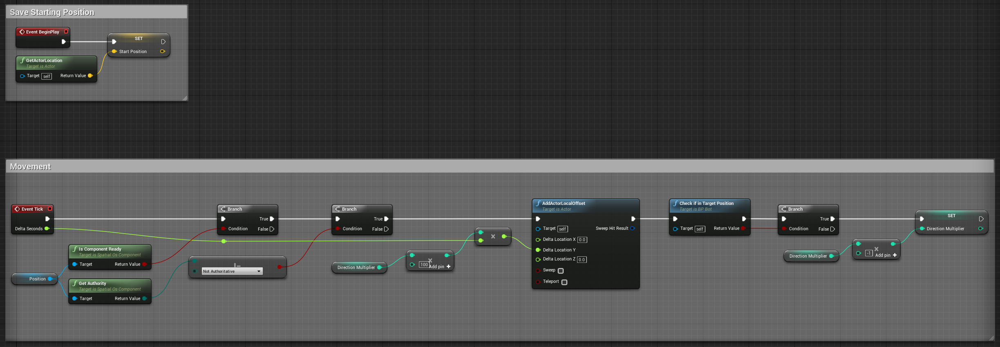
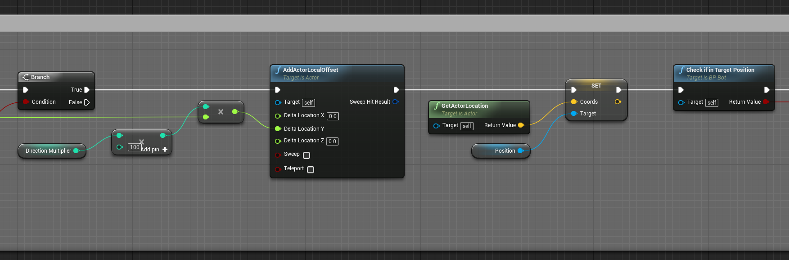
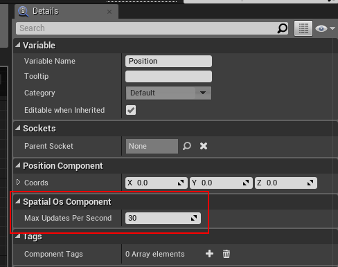
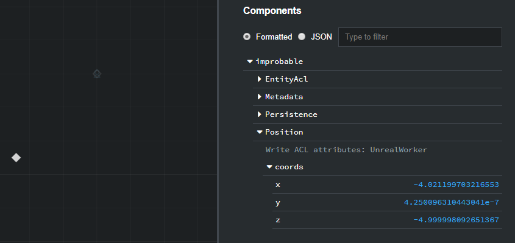
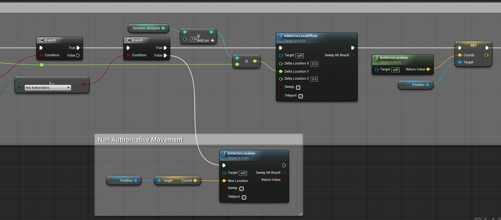
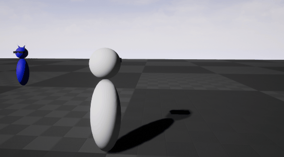

# Unreal Basics 2 - Updating a component property

Now that everything's set up, you'll be adding movement to the bot. To do so, you'll:

* **use the Position component** of SpatialOS entities
* **learn about authority** and worker synchronization
* **modify and read properties** of a component

## 1. Modifying the Position

In the previous lesson, you learned about components and how they contain the information about entities.

In this lesson, you will be using the existing `Position` component to change the position of the bot.

### 1.1. Look at the bot movement Blueprint

The code that handles the movement of the bot is quite simple: it gets the initial position and makes the bot move back and forth along one axis for a specified distance at 1m/s.

Open the `BP_Bot Event Graph` to see it:

So, if the bot has code for movement, why doesn’t it move when you run the game? Well, it does, but only on the `UnrealWorker` side, not in the `UnrealClient` side, which is the one you see when you run the project inside the Unreal Editor. It is also possible to run an `UnrealWorker` in the Unreal Editor, not just an `UnrealClient`, but you don’t need to do this right now.

As you can see, there's a check for `authority` on the `Position` component, so only the instance of the blueprint that is authoritative over the component will move the bot, while other instances won't.

### 1.2. Authority

We've talked about [authority (SpatialOS documentation)](https://docs.improbable.io/reference/12.2/shared/glossary#read-and-write-access-authority) before, but what exactly does it mean?

In SpatialOS, even though all workers can check out and read the values of all the components on all the entities, only one worker at a time has `authority` over one specific component. In this way, only the worker with `authority` over a component can modify the values of that component. Makes sense right? That way, we can ensure there's a canonical source of truth for each component, because no two workers will try to change a value on a component at the same time.

When creating entities, you can specify which types of workers can be authoritative over specific components. In this project, the `Position` component of the bot has been defined so that only `UnrealWorker`s can be authoritative over it. This doesn’t set one specific `UnrealWorker` to have authority over it; it just sets it so that any `UnrealWorker` can be authoritative over it, but no `UnrealClient`  (or any other type of worker) can.

You could also define a component so that only one specific worker can be authoritative over it (for example, in this project, when you create a `Player`, only the worker that requests the creation of that player will be authoritative over the `Position` component of the `Player` entity).

You will learn more about how to define which worker can be authoritative over which components in future lessons of this tutorial.

### 1.3. Using the SpatialOS Position

We've said that the bot is moving on the `UnrealWorker` and not on the `UnrealClient`, but in Lesson 1, you opened the Inspector and didn't see it moving at all. Why was that?

The `BP_Bot` blueprint only modifies the Unreal concept of position (`ActorLocation`), not the SpatialOS `Position` component, so SpatialOS doesn't know about the entity moving. This is why it doesn't show it moving in the Inspector. You're going to fix that now.

0. Open the `BP_Bot Event Graph`.

0. Get the Actor Location with `GetActorLocation` and `Set` the `Coords` in the `Position` component after the movement has been added to the local position in `AddActorLocalOffset`. When you create your own components, SpatialOS will generate setters/getters for its properties. In this case, `Position` only has the `Coords` property, which is what you want to modify.

0. Before using a component, make sure it's ready by checking `IsComponentReady`. In this case, it's already done at the beginning of the tick, so you don't need it again.

It should look like this:

That's it! SpatialOS components in Unreal have an auto-replication feature that automatically syncs the information on the component x times per second. You can modify this value by selecting the component and changing the `Max Updates Per Second` field of the component.

Now, **Save** the blueprint, **Compile** it, and run the project locally (remember: `spatial local launch`) and connect your client. You'll see that the bot… still doesn't move!

Let's open the Inspector and see what's going on. Hey, it's moving!

Select the `BP_Bot` entity and check the `Position` component. You'll see that, effectively, the values of the `Coords` are being updated correctly.

So, why doesn't it move in your client? Because you've updated the SpatialOS `Position` from the authoritative worker, but you're not replicating that change in the instances of the entity where the worker is not authoritative over the component. Let's do that.

## 2. Replicating the Position

Since the auto-replication is activated, you just need to check for the value of the SpatialOS `Position` component and update the Unreal `ActorLocation` with the updated information.

To do so:

0. Be sure that you have stopped SpatialOS, the `UnrealWorker` and the `UnrealClient`.

0. Open the `BP_Bot Event Graph`.

0. Create a new flow from the second `Branch` instruction where you check for the component authority over the `Position` component when the condition is `False`.

0. `Get` the `Coords` from the component and use the value as the input for `SetActorLocation`.

It should look like this:

> In this example, you are just polling for changes in the value of the `Position` component. In the next lesson, you'll learn that you can register interest in a component and receive a callback when it changes.

Now, **Save** the blueprint, **Compile** it and run the project locally and connect your client. You will see now that the bot... is finally moving!

> As you can see, the movement is quite jerky because there's no client-side prediction or any kind of movement smoothing. We'll publish an improved movement tutorial in the future.

## Lesson summary

In this lesson you've learned how to write to and read from components, and how authority works in SpatialOS. These are the core concepts that you'll need in order to work with SpatialOS. When writing your logic, you have to take into account which type of worker is running the code for your entities (and more specifically, is it authoritative over a specific component?) and write code accordingly.

You also used the auto-replication feature to sync information on components, but there is another way of doing it manually which you can learn more about [here](../../interact-with-world/interact-components.md). This page also talks about [events (SpatialOS documentation)](https://docs.improbable.io/reference/12.2/shared/glossary#event) and [commands (SpatialOS documentation)](https://docs.improbable.io/reference/12.2/shared/glossary#command), which we don't cover in detail in this this tutorial.

