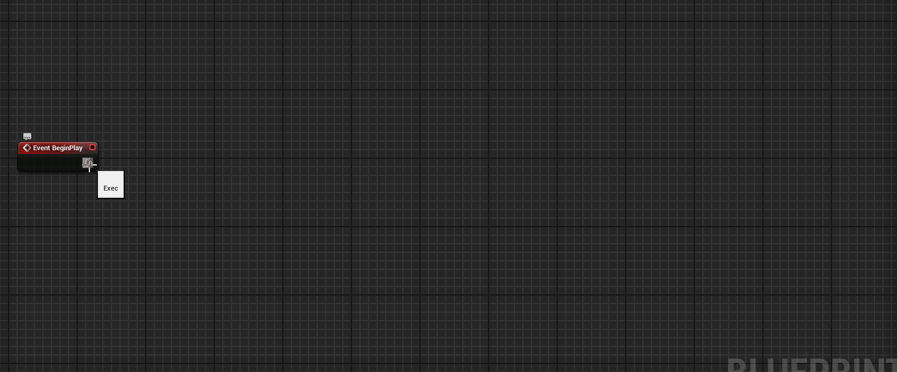
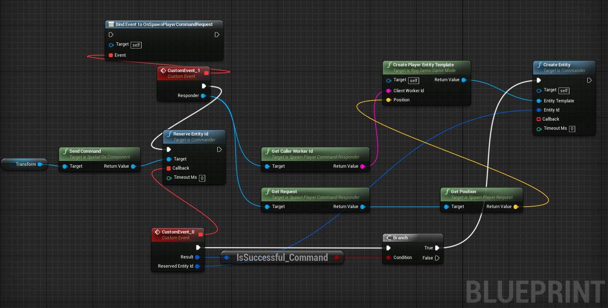
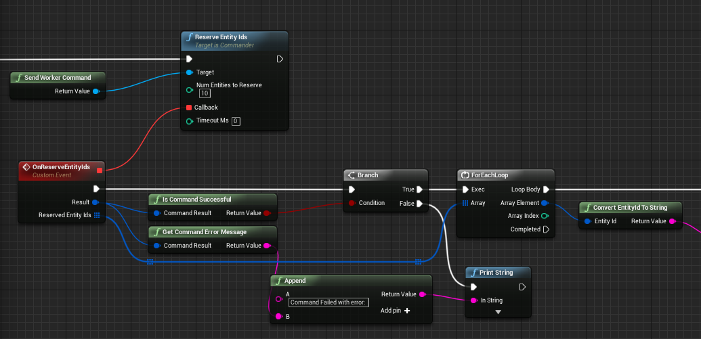
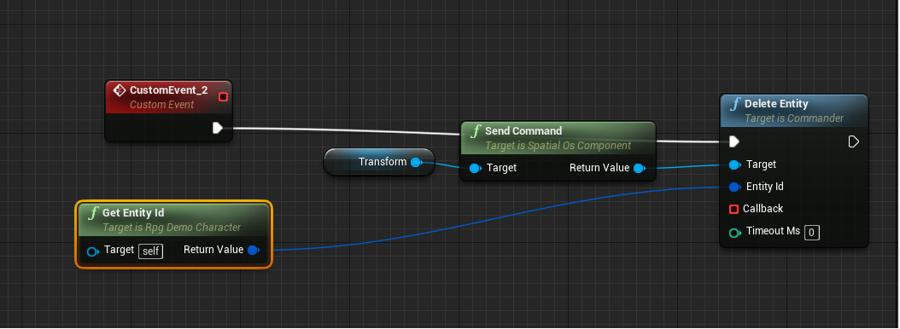

# Creating and deleting entities

To create or delete [entities in the SpatialOS world (SpatialOS documentation)](https://docs.improbable.io/reference/12.2/shared/glossary#spatialos-world),
you use "[world commands (SpatialOS documentation)](https://docs.improbable.io/reference/12.2/shared/design/commands)". To run a world command, a worker must
have **permission**. For information, see the [Worker permissions (SpatialOS documentation)](https://docs.improbable.io/reference/12.2/shared/worker-configuration/permissions) page.

You should send world commands from components on your entities when possible. A worker will need write access to some component
in order to send a command.

> In rare circumstances, a worker won’t have write access to any components
(for example, when a client worker is bootstrapping itself). In this case, you can send a command from a
worker directly instead. The syntax and blueprint nodes for both methods are the
same. We don't recommend doing this in any other situation.

## Creating an entity

To create an entity, you [create the entity's template](#1-create-an-entity-template), then
[send the `CreateEntity` command](#2-create-an-entity).

> An **entity template** is an object that specifies all the components that the entity has.

This assumes you've already created a blueprint for the entity. If you haven't, see the
[Creating entity blueprints](../interact-with-world/entity-blueprints.md) page for instructions.

### 1. Create an entity template

Entity templates must have at least these three components:

* a `Position` component, which specifies the location of your entity.
* a `Metadata` component, which has the property `entity_type` that is used to specify the blueprint to use for this entity.
* a `EntityAcl` component, which controls the read and write access that workers have to the entity and its components. See
[Understanding write access (SpatialOS documentation)](https://docs.improbable.io/reference/12.2/shared/design/understanding-access) for more information.

Most entities also should have a `Persistence` component, which means that you want it to persist in
snapshots.
The EntityBuilder pattern requires you to specify whether or not you want your entity to be persistent.

For information about designing an entity and its components, see the [Designing entities (SpatialOS documentation)](https://docs.improbable.io/reference/12.2/shared/design/design-entities) page.

For information about the required components, see the [Standard schema library (SpatialOS documentation)](https://docs.improbable.io/reference/12.2/shared/schema/standard-schema-library) page.

You can create an entity template in code, or in blueprints.

#### In code using the Entity Builder helper

The easiest way to create an entity template is to use the `FEntityBuilder` helper class.
This helper class ensures that the required SpatialOS components and their respective ACLs are added to the entity template
when created.

0. Include the necessary header files for the `improbable::worker`, `Position`, `Metadata`
and `Persistence` types and your component types. For example:

    ```cpp
    #include <improbable/worker.h>
    #include <improbable/standard_library.h>
    ```

0. Set up the worker attributes and worker requirement sets:

    ```cpp
    using namespace improbable;

    const Coordinates initialPosition{0.0, 0.0, 0.0};

    WorkerAttributeSet unrealWorkerAttributeSet{ {worker::List<std::string>{"UnrealWorker"}} };
    WorkerAttributeSet unrealClientAttributeSet{ {worker::List<std::string>{"UnrealClient"}} };

    WorkerRequirementSet unrealWorkerWritePermission{ {unrealWorkerAttributeSet} };
    WorkerRequirementSet unrealClientWritePermission{ {unrealClientAttributeSet} };
    WorkerRequirementSet anyWorkerReadPermission{ {unrealClientAttributeSet, unrealWorkerAttributeSet} };

    worker::Map<std::uint32_t, WorkerRequirementSet> componentAuthority;
    ```
0. Call `improbable::unreal::FEntityBuilder::Begin()` to start the creation. When all components are added,
finish creating the entity template by calling `Build()`:

    ```cpp
    auto snapshotEntity =
      improbable::unreal::FEntityBuilder::Begin()
      .AddPositionComponent(Position::Data{initialPosition}, unrealWorkerWritePermission)
      .AddMetadataComponent(Metadata::Data{"Npc"})
      .SetPersistence(true)
      .SetReadAcl(anyWorkerReadPermission)
      // After this point, all required components will have been set. More components can be added with
      //.AddComponent<T>(T::Data, unrealWorkerWritePermission)
      .Build();
    ```
0. (optional) If you need to set [write access (SpatialOS documentation)](https://docs.improbable.io/reference/12.2/shared/glossary#read-and-write-access-authority)
on the [`EntityACL` component (SpatialOS documentation)](https://docs.improbable.io/reference/12.2/shared/glossary#acl) itself,
call `SetEntityAclComponentWriteAccess()` as shown below:

    ```cpp
    auto snapshotEntity =
      improbable::unreal::FEntityBuilder::Begin()
      .AddPositionComponent(Position::Data{initialPosition}, unrealWorkerWritePermission)
      .AddMetadataComponent(Metadata::Data{"Npc"})
      .SetPersistence(true)
      .SetReadAcl(anyWorkerReadPermission)
      .SetEntityAclComponentWriteAccess(CommonRequirementSets.PhysicsOnly)
      .Build();
    ```

#### In code without using the Entity Builder helper

To create an entity template in code:

0. Include the necessary header files that contains the required `improbable::worker` and `standard_library` types:

    ```cpp
    #include <improbable/worker.h>
    #include <improbable/standard_library.h>
    ```

0. Create a blank entity template. For example:

    ```cpp
    auto entityTemplate = worker::Entity();
    ```
0. Add the required components `Position` and `Metadata`. In the Metadata component, set the "entity type"
property to the name of the [the blueprint for this entity]
(../interact-with-world/entity-blueprints.md):

    ```cpp
    const Coordinates initialPosition{ 0.0, 5.0, 0.0 };
    entityTemplate.Add<Metadata>(Metadata::Data("Npc"));
    entityTemplate.Add<Position>(Position::Data{initialPosition});
     ```
0. (optional) If you intend to serialize this entity during the execution of your simulation, then you should
add a `Persistence` component to your entity as shown in the example below:

    ```cpp
    entityTemplate.Add<Persistence>(Persistence::Data{});
     ```
0. Add any other components you want to and their initial data.
0. Add an `EntityAcl` component that defines which types of workers have read and write access to the components on
your entity. For example:

    ```cpp
    WorkerAttributeSet unrealWorkerAttributeSet{ {worker::Option<std::string>{"UnrealWorker"}} };
    WorkerAttributeSet unrealClientAttributeSet{ {worker::Option<std::string>{"UnrealClient"}} };

    WorkerRequirementSet unrealWorkerWritePermission{{unrealWorkerAttributeSet}};
    WorkerRequirementSet unrealClientWritePermission{ { unrealClientAttributeSet } };
    WorkerRequirementSet anyWorkerReadPermission{{unrealClientAttributeSet, unrealWorkerAttributeSet}};

    worker::Map<std::uint32_t, WorkerRequirementSet> componentAuthority;
    componentAuthority.emplace(common::Transform::ComponentId, unrealWorkerWritePermission);

    ComponentAcl componentWritePermissions(componentAuthority);
    entityTemplate.Add<EntityAcl>(EntityAcl::Data(anyWorkerReadPermission, componentWritePermissions));
    ```

#### In blueprints

> Building up ACLs in blueprints is cumbersome. It might be better to build your ACLs
in a C++ Blueprint Function library first, and use those functions in your blueprint graph.

To create an entity template in blueprints:



### 2. Create an entity

You create an entity by reserving an entity ID, then sending a command to create an entity with that ID.

To create an entity in code (for example, from an `Actor` derived class that has a `TransformComponent`):

0. Define a callback method to be triggered when you receive a response to the reserve ID command. For example:

    ```cpp
    void AMyCharacter::OnReserveEntityIdResponse(const FSpatialOSCommandResult& Result, FEntityId ReservedEntityId)
    {
        if (!Result.Success())
        {
            // error handling, retry logic (Result.GetErrorMessage() may contain more info)
            return;
        }
        ...
    }
    ```
0. Define this method in your header file too. Declare your callback method as a UFunction by using the `UFUNCTION()` decorator.
0. Declare a dynamic delegate of type `FReserveEntityIdResultDelegate` (this delegate is automatically generated) and bind it to your callback method:

    ```cpp
    FReserveEntityIdResultDelegate CallbackDelegate;
    CallbackDelegate.BindDynamic(this /* reference to an object of type AMyCharacter */, &AMyCharacter::OnReserveEntityIdResponse);
    ```
0. Send a reserve entity ID command. Pass in your callback delegate, and 0 for the timeout
(so it'll use the default timeout). For example:

    ```cpp
    auto RequestId = TransformComponent->SendCommand()->ReserveEntityId(CallbackDelegate, 0);
    if (!RequestId.IsValid())
    {
        // failure handling
    }
    ```
	Sending a command immediately returns a unique request ID for this command request. This request ID can be used to link up and trace the sent request. If the command request failed to send, the method `IsValid` of the returned request ID will be false.
0. Define a callback method to be triggered when you receive a response to the create entity command. For example:

    ```cpp
    void AMyCharacter::OnCreateEntityResponse(const FSpatialOSCommandResult& Result, FEntityId CreatedEntityId)
    {
        if (!Result.Success())
        {
            // error handling, retry logic (Result.GetErrorMessage() may contain more info)
            return;
        }
        if (Result.RequestId.IsValid())
        {
            //look up the command request using the RequestId returned from the Result.
        }
        ...
    }
    ```
    The command result from the response also contains the request ID which was sent in the command request. This can be used to link up the response with the request.
0. Define this method in your header file too. Declare your callback method as a UFunction by using the `UFUNCTION()` decorator.
0. Declare a dynamic delegate of type `FCreateEntityResultDelegate` (this delegate is automatically generated) and bind it to your callback method:

    ```cpp
    FCreateEntityResultDelegate CallbackDelegate;
    CallbackDelegate.BindDynamic(this /* reference to an object of type AMyCharacter */, &AMyCharacter::OnCreateEntityResponse);
    ```

0. Send a create entity command. Pass in:
    * the entity template
    * the reserved entity ID
    * the callback delegate
    * 0 for the timeout

    For example:

    ```cpp
    TransformComponent->SendCommand()->CreateEntity(entityTemplate, reservedEntityId, CallbackDelegate, 0);
    ```

### Full example of creating an entity

In code:

```cpp
worker::Entity AMyCharacter::CreateMyCharacterEntityTemplate()
{
    const Coordinates initialPosition{0.0, 0.0, 0.0};

    WorkerAttributeSet unrealWorkerAttributeSet{ {worker::List<std::string>{"UnrealWorker"}} };
    WorkerAttributeSet unrealClientAttributeSet{ {worker::List<std::string>{"UnrealClient"}} };

    WorkerRequirementSet unrealWorkerWritePermission{ {unrealWorkerAttributeSet} };
    WorkerRequirementSet unrealClientWritePermission{ {unrealClientAttributeSet} };
    WorkerRequirementSet anyWorkerReadPermission{ {unrealClientAttributeSet, unrealWorkerAttributeSet} };

    worker::Map<std::uint32_t, WorkerRequirementSet> componentAuthority;

    auto snapshotEntity =
      improbable::unreal::FEntityBuilder::Begin()
      .AddPositionComponent(Position::Data{initialPosition}, unrealWorkerWritePermission)
      .AddMetadataComponent(Metadata::Data{"Npc"})
      .SetPersistence(true)
      .SetReadAcl(anyWorkerReadPermission)
      // After this point, all required components will have been set. More components can be added with
      //.AddComponent<T>(T::Data, unrealWorkerWritePermission)
      .Build();
    return snapshotEntity;
}

void AMyCharacter::OnReserveEntityIdResponse(const FSpatialOSCommandResult& Result, FEntityId ReservedEntityId)
{
    if (!Result.Success())
    {
        // error handling, retry logic (Result.GetErrorMessage() may contain more info)
        return;
    }
    FCreateEntityResultDelegate CallbackDelegate;
    CallbackDelegate.BindDynamic(this, &AMyCharacter::OnCreateEntityResponse);
    TransformComponent->SendCommand()->CreateEntity(CreateMyCharacterEntityTemplate(), reservedEntityId, CallbackDelegate, 0);
}

void AMyCharacter::OnCreateEntityResponse(const FSpatialOSCommandResult& Result, FEntityId CreatedEntityId)
{
    if (!Result.Success())
    {
        // error handling, retry logic (Result.GetErrorMessage() may contain more info)
    }
}

void AMyCharacter::CreateMyCharacterEntity()
{
    FReserveEntityIdResultDelegate CallbackDelegate;
    CallbackDelegate.BindDynamic(this, &AMyCharacter::OnReserveEntityIdResponse);
    TransformComponent->SendCommand()->ReserveEntityId(CallbackDelegate, 0);
}
```

In blueprints:



### Bulk reserve entities in Blueprint

You can reserve multiple `EntityID`'s in a single command using `ReserveEntityIds`. If successful, the callback
will return an array of `FEntityID`'s.



## Deleting an entity

To delete an entity, you'll need the entity's `EntityId`.

You can get the `EntityId` by [querying the world](../interact-with-world/query-world.md).

### Deleting an entity in code

To delete an entity with the given entity ID:

0. Define a callback method to be triggered when you receive a response from the command. For example:

    ```cpp
    void AMyCharacter::OnDeleteEntityResponse(const FSpatialOSCommandResult& Result)
    {
        if (!Result.Success())
        {
            // error handling, retry logic (Result.GetErrorMessage() may contain more info)
            return;
        }
        ...
    }
    ```
0. Define this method in your header file too. Declare your callback method as a UFunction by using the `UFUNCTION()` decorator.
0. Declare a dynamic delegate of type `FDeleteEntityResultDelegate` (this delegate is automatically generated) and bind it to your callback method:

    ```cpp
    FDeleteEntityResultDelegate CallbackDelegate;
    CallbackDelegate.BindDynamic(this /* reference to an object of type AMyCharacter */, &AMyCharacter::OnDeleteEntityResponse);
    ```
0. Send a delete entity command. Pass in your callback delegate, and 0 for the timeout
(so it'll use the default timeout). For example:

    ```cpp
    TransformComponent->SendCommand()->DeleteEntity(entityId, CallbackDelegate, 0);
    ```

### Deleting an entity in blueprints

To delete an entity with the given entity ID:


