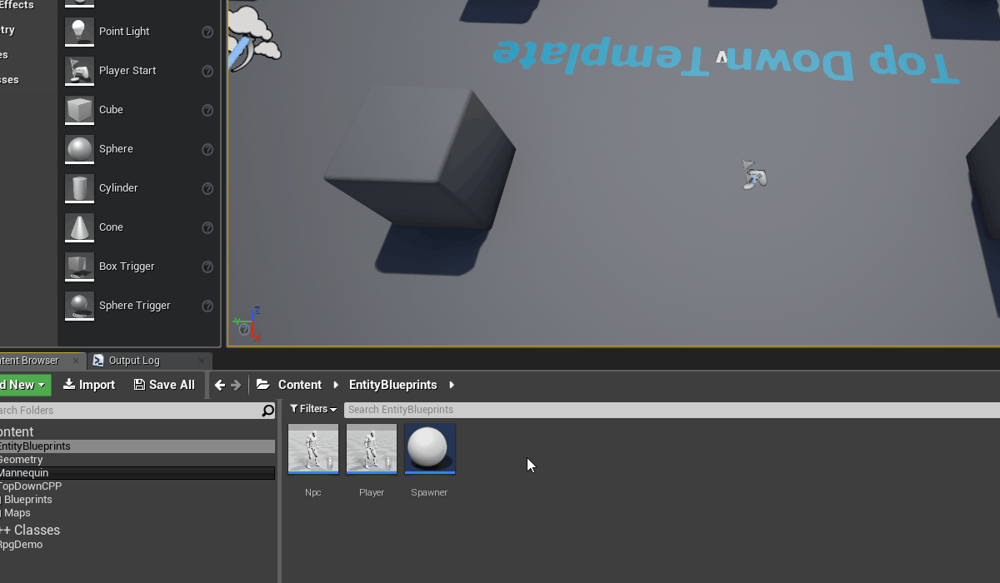
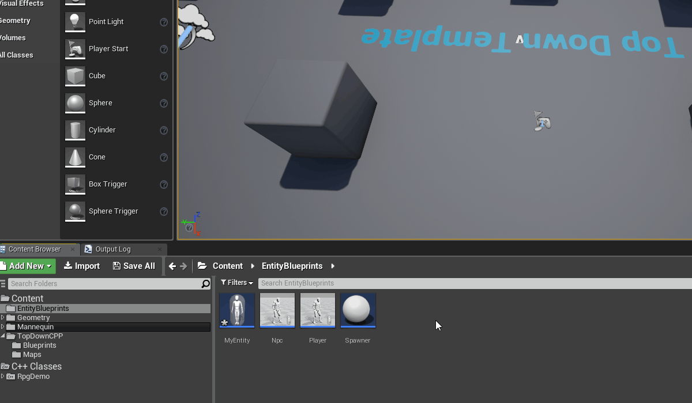
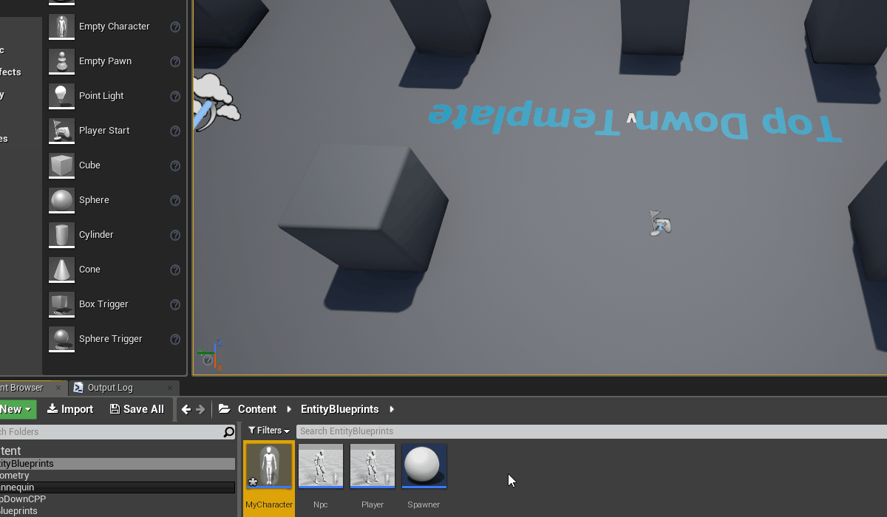

# Creating entity blueprints

In order to connect the world that an [Unreal worker (SpatialOS documentation)](https://docs.improbable.io/reference/12.2/shared/glossary#worker) sees to the
[game world (SpatialOS documentation)](https://docs.improbable.io/reference/12.2/shared/glossary#spatialos-world) that
SpatialOS manages, you need to connect [SpatialOS entities (SpatialOS documentation)](https://docs.improbable.io/reference/12.2/shared/glossary#entity) to Unreal blueprints.

To tell an Unreal worker which blueprint to use to represent an entity in the world, you specify something called
an "entity type" for each entity. You need to do this when you
[add an entity to the initial state of your world](../configuration/change-snapshot.md), and when you
[create an entity](../interact-with-world/create-delete-entities.md).

To create a new type of entity in your world, you need to:

1. [Create an entity blueprint](#create-an-entity-blueprint).
2. [Add the components you want the entity to have to the blueprint](#add-components-to-an-entity-blueprint).
3. [Create the entity](../interact-with-world/create-delete-entities.md),
or [add it to the initial state of your world](../configuration/change-snapshot.md).

    You must use the *exact name of the blueprint* as the "entity type".

## Create an entity blueprint

All blueprints for entities must be in the  `EntityBlueprints` folder, in the the root `Content` folder
(which you can navigate to from the Content Browser in the Editor).

When you create an entity blueprint, you have the following options:

* If you want all of your entity logic in blueprints, create a [blueprint-only blueprint](#blueprint-only).
* If you want your logic in C++, [create a C++ class, and then create a dummy child blueprint of this class](#c-class).

You could also have some logic in C++, and some in the child blueprint, to avoid doing things in blueprints that are easier to do in C++.

### Blueprint-only

To create a blueprint-only entity blueprint:

0. In the Editor, in the Content Browser, navigate to the `EntityBlueprints` folder located in the root `Content` folder.
0. Right-click inside the folder, and select `Blueprint Class` under the heading `Create Basic Asset`.
0. As the parent class, select either `Actor` or a class that inherits from `Actor` (such as `Pawn` or `Character`).
0. Give the blueprint the name that you want to use as the "entity type".



### C++ class

To create a C++ class for an entity blueprint:

0. In the Editor, in the Content Browser, navigate to the `C++ classes` folder located in the root `Content` folder.
0. Right-click inside the folder and select `Create C++ class`.
0. As the parent class, select either `Actor` or a class that inherits from `Actor` (such as `Pawn` or `Character`).

    
0. Navigate to the `EntityBlueprints` folder located in the root `Content` folder.
0. Right-click inside the folder and select `Blueprint Class` under the heading `Create Basic Asset`.
0. Select the C++ class you just created as the parent.
0. Give the blueprint the name that you want to use as the "entity type".

    

## Add components to an entity blueprint

SpatialOS [components (SpatialOS documentation)](https://docs.improbable.io/reference/12.2/shared/glossary#component) define all
the data associated with an entity. [Read more about components (SpatialOS documentation)](https://docs.improbable.io/reference/12.2/shared/concepts/entities#components).

For information on deciding what components your entity should have, see
[Designing components (SpatialOS documentation)](https://docs.improbable.io/reference/12.2/shared/design/design-components).

You can add components to your entity blueprint:

* [in blueprints (for blueprint-only classes and C++ classes)](#add-components-in-blueprints)
* [in code (for C++ classes only)](#add-components-in-code)

Note that you'll also need to add the same components to the entity template when you create the entity. See the section on
[Creating an entity](../interact-with-world/create-delete-entities.md#creating-an-entity) for details.

### Add components in blueprints

To add SpatialOS components to a blueprint-only entity blueprint:

0. In the Content Browser, navigate to the `EntityBlueprints` folder.
0. Select and double-click the blueprint that you'd like to add a component to.
0. Make sure that the generated code for your Unreal project is up to date by running `spatial codegen`.

    This will generate a `UActorComponent` for each component defined in your [schema (SpatialOS documentation)](https://docs.improbable.io/reference/12.2/shared/glossary#schema).

    You can attach these to your entities' `Actor` blueprints, and use them to interact with the corresponding SpatialOS component
    on the corresponding entity. See [Interacting with entity components](../interact-with-world/interact-components.md) for details.
0. The blueprint Editor will appear. Select `Add Component` in the `Components` panel.
0. In the search field, start typing the name of your SpatialOS component. The suggestion box should have an `ActorComponent` named
`{name of the component}Component` for each SpatialOS component defined in your schema.

    

### Add components in code

To add components in code:

0. Find the parent C++ class of your blueprint that you created, and open it in Visual Studio.
0. Open the header file. Under `private:`, declare a member variable for your component. For example:

    ```cpp
    UPROPERTY(VisibleAnywhere, BlueprintReadOnly, Category = "Character", meta = (AllowPrivateAccess = "true"))
    class UTransformComponent* TransformComponent;
    ```

    > **Note**: The `class` prefix is a forward declaration, so you don't need to include the header file `TransformComponent.h` in this file.
0. Under `public:`, add a getter function:

    ```cpp
    FORCEINLINE class UTransformComponent* GetTransformComponent() const
    {
        return TransformComponent;
    }
    ```
0. Open the implementation file of your C++ class. In the constructor, initialise the component:

    ```cpp
    TransformComponent = CreateDefaultSubobject<UTransformComponent>(TEXT("TransformComponent"));
    ```
0. Include the necessary header file at the top of this file:

    ```cpp
    #include "Improbable/Generated/cpp/unreal/TransformComponent.h"`
    ```

## What's next

[Create the entity](../interact-with-world/create-delete-entities.md),
or [add it to the initial state of your world](../configuration/change-snapshot.md).
