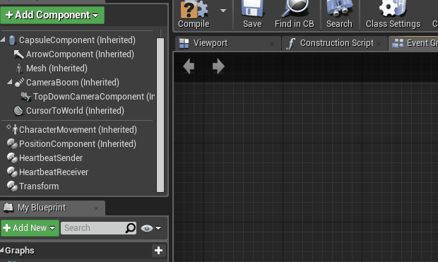
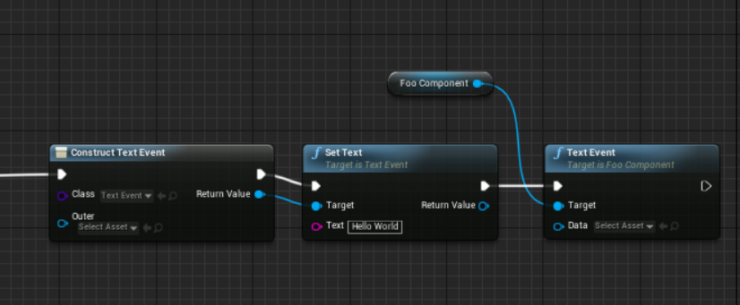
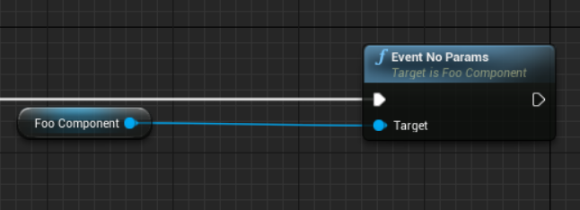
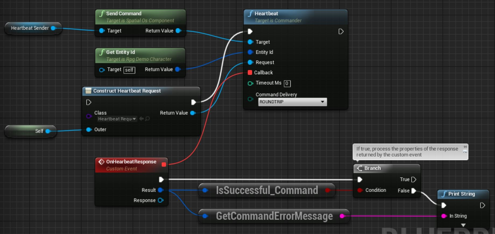
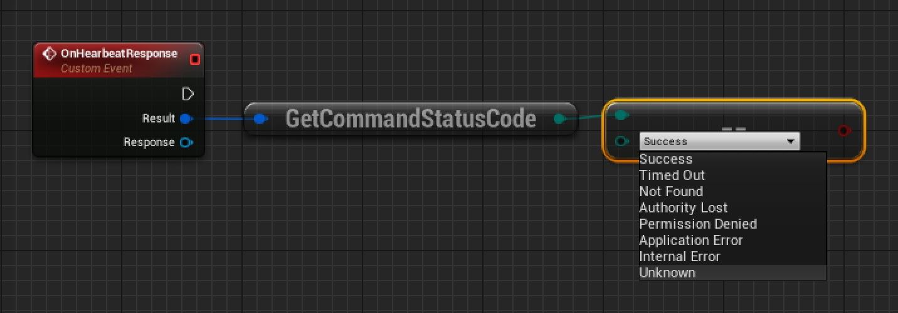
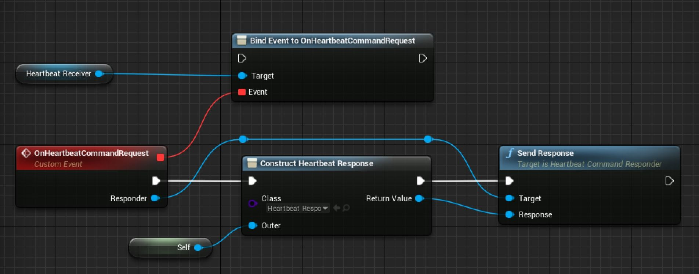

# Interacting with entity components

This page details the ways that an [Unreal worker (SpatialOS documentation)](https://docs.improbable.io/reference/12.2/shared/concepts/workers) can interact with the 
[components (SpatialOS documentation)](https://docs.improbable.io/reference/12.2/shared/concepts/entities#components) on
[SpatialOS entities (SpatialOS documentation)](https://docs.improbable.io/reference/12.2/shared/concepts/entities). They can interact with three things in a component:
properties, events, and commands. See [Designing components (SpatialOS documentation)](https://docs.improbable.io/reference/12.2/shared/design/design-components) for
details of what these are.

The code used to do this is generated from schema when you run [`spatial worker codegen` (SpatialOS documentation)](https://docs.improbable.io/reference/12.2/shared/spatial-cli/spatial-worker-codegen).
When you change your schema, you  must run this command to get up-to-date code and blueprint nodes to use.

For information about creating components themselves, see the 
[schema documentation (SpatialOS documentation)](https://docs.improbable.io/reference/12.2/shared/schema/introduction).

This page uses the example of an [entity blueprint](../interact-with-world/entity-blueprints.md) called `MyCharacter`.
It has a custom C++ parent class `AMyCharacterCpp` that inherits from `ACharacter`, and has a generated `UTransformComponent`
actor component as a member with a public getter `TransformComponent()`.

## Prerequisites

To interact with an entity's SpatialOS component using the UnrealSDK, make sure you have [added the corresponding 
generated `UActorComponent` to the entity's blueprint](../interact-with-world/entity-blueprints.md#add-components-to-an-entity-blueprint).

## Check if the component is ready

Before you invoke *any* methods on an UnrealSDK generated `UActorComponent`, make sure the component is ready.

To check a component is ready in code:

```cpp
if (!TransformComponent->IsComponentReady())
{
    return;
}
// can use the component
```

To check a component is ready in blueprints:


To listen for when a component becomes ready in code:

0. Create a method to be invoked when the component becomes ready:

    ```cpp
    void AMyCharacterCpp::OnTransformComponentReady()
    {
        // start using the component
    }
    ```
0. Bind this method to the `OnComponentReady` event on the `TransformComponent`:

    ```cpp
    TransformComponent->OnComponentReady.AddDynamic(this, &AMyCharacterCpp::OnTransformComponentReady);
    ```

To listen for when a component becomes ready in blueprints:


## Get the value of a property

Prerequisites:

* the worker must have [read access (SpatialOS documentation)](https://docs.improbable.io/reference/12.2/shared/glossary#read-and-write-access-authority) on the component
* the component must be [ready](#check-if-the-component-is-ready)

To get the value of a property in code:

```cpp
auto currentPosition = TransformComponent->Position;
```

To get the value of a property in blueprints:


## Set the value of a property

Prerequisites:

* the worker must have [write access (SpatialOS documentation)](https://docs.improbable.io/reference/12.2/shared/glossary#read-and-write-access-authority) on the component
* the component must be [ready](#check-if-the-component-is-ready)

To set the value of a property, you can:

* Use automatic state replication, changing the property and letting the component replicate its state automatically (our suggested approach)
* Use manual state replication, changing the property and manually triggering the component update

### Automatic state replication

Each component has a configurable field `MaxUpdatesPerSecond` which allows you to specify how frequently you'd like the component
to replicate its state. `MaxUpdatesPerSecond` defaults to *30* updates per second, and any value above *0* keeps automatic updates enabled.
Updates will be triggered at the specified rate when changes to the component data are detected.

The update rate impacts the bandwidth usage and the local execution time, as it determines how frequently components
are checked for local changes.

To set the value of a property in code:

```cpp
TransformComponent->Position = FVector{0.f, 10.f, 0.f};
// or
TransformComponent->Position.Y = 10.f;
```

To change the update rate in code:

```cpp
TransformComponent->MaxUpdatesPerSecond = 10;
```

To set the value of a property in blueprints:


To change the update rate in blueprints:



Remember to call `USpatialOSComponentUpdater->UpdateComponents()` after you call `USpatialOS->ProcessOps()`. For more information, see [Processing operations](../configuration/worker-setup.md#processing-operations):

```cpp
USpatialOSComponentUpdater->UpdateComponents(EntityRegistry, DeltaTime);
```

`MaxUpdatesPerSecond` defines the frequency of the component change replication while `USpatialOSComponentUpdater->UpdateComponents()` actually flushes out the changes in components and propagates them over network.

The argument DeltaTime is used to track the update rate according to the setting MaxUpdatesPerSecond in the components.

### Manual state replication

Automatic updates should be sufficient for most use cases, but you can send manual updates to ensure state is replicated immediately 
when it changes, rather than waiting for the next fixed update window. You can disable automatic updates on a per-component basis, by 
setting `MaxUpdatesPerSecond` to *0*. Then, to send a manual component update, you'll need to set the properties like you would for an
automatic update, and then call the `TriggerManualComponentUpdate` method on the component.

To send an update manually in code:

```cpp
TransformComponent->Position = FVector{0.f, 10.f, 0.f};
TransformComponent->TriggerManualComponentUpdate();
```

To send an update manually in blueprints:


## Responding to a change of a property

Prerequisites:

* the worker must have [read access (SpatialOS documentation)](https://docs.improbable.io/reference/12.2/shared/glossary#read-and-write-access-authority) on the component
* the component must be [ready](#check-if-the-component-is-ready)

To respond to a change in a specific property in code:

0. Create a method to be invoked when a position update is received:

    ```cpp
    void AMyCharacterCpp::OnTransformPositionUpdate()
    {
        SetActorLocation(TransformComponent->Position);
    }
    ```
0. Include the method declaration in your header file.
0. Bind this method to the `OnPositionUpdate` event on the `TransformComponent`:

    ```cpp
    TransformComponent->OnPositionUpdate.AddDynamic(this, &AMyCharacterCpp::OnTransformPositionUpdate);
    ```

To respond to a change in a specific property in blueprints:


To respond to a change in any property of a component in code:

0. Create a method to be invoked when a component update is received, and access the new properties directly from the component:

    ```cpp
    void AMyCharacterCpp::OnTransformComponentUpdate()
    {
		SetActorLocation(TransformComponent->Position);
    }
    ```
0. Include the method declaration in your header file.
0. Bind this method to the `OnComponentUpdate` event:

    ```cpp
    TransformComponent->OnComponentUpdate.AddDynamic(this, &AMyCharacterCpp::OnTransformComponentUpdate);
    ```

To respond to a change in any property of a component in blueprints:


## Triggering an event

Prerequisites:

* the worker must have [write access (SpatialOS documentation)](https://docs.improbable.io/reference/12.2/shared/glossary#read-and-write-access-authority) on the component
* the component must be [ready](#check-if-the-component-is-ready)

> Unreal RPCs vs SpatialOS events" type="info" message="The closest equivalent to SpatialOS events in Unreal
Engine is a multicast RPC.

To trigger an event in code:

```cpp
UTextEvent* MyEvent = NewObject<UTextEvent>()->Init({"Hello World"});
MyComponent->TextEvent(MyEvent);
```

Note that if the type of the event that you defined in your schema file has no fields, you don't need to pass a parameter into the
event trigger function.

For example, if your event definition in your `.schema` file is

```
event Empty empty_event;
```

And `Empty` is defined as

```
type Empty
{
}
```

You will be able to trigger your event in Unreal by simply calling

```cpp
TransformComponent->EmptyEvent();
```

To trigger an event in blueprints:

If the event type has fields, then you need to pass a UObject of the type that matches the event type. An example
can be seen below:



Similar to triggering an event in code, empty event types do not require a parameter to be passed in blueprints.



The event will be sent the next time that the component is automatically replicated. If the automatic
replication is disabled, you will need to manually trigger the component update after triggering the
event by calling `TriggerManualComponentUpdate` on the component.

## Responding to an event

Prerequisites:

* the worker must have [read access (SpatialOS documentation)](https://docs.improbable.io/reference/12.2/shared/glossary#read-and-write-access-authority) on the component
* the component must be [ready](#check-if-the-component-is-ready)

Responding to an event is much like [responding to a change of a property](#responding-to-a-change-of-a-property). 

To respond to an event in code:

0. Create a method to be invoked when the event is received:

    ```cpp
    void AMyCharacterCpp::OnTransformTextEvent(UTextEvent* textEvent)
    {
        auto text = textEvent->GetText();
        // print text
    }
    ```
0. Include the method declaration in your header file.
0. Bind this method to the `OnTextEvent` event on the `TransformComponent`:

    ```cpp
    TransformComponent->OnTextEvent.AddDynamic(this, &AMyCharacterCpp::OnTransformTextEvent);
    ```

To respond to an event in blueprints:


## Sending a command

Entity commands are defined in the schema, and the definition includes an input type 
and a return type.

When you send a command, register a callback to receive a response, which includes:

* information about the command's success or failure
* a response object of the command return type

It is guaranteed that SpatialOS will only report a 
command's success if it actually succeeded, but [no other guarantees are made (SpatialOS documentation)](https://docs.improbable.io/reference/12.2/shared/design/commands#caveats). 

Prerequisites:

* the worker must have [write access (SpatialOS documentation)](https://docs.improbable.io/reference/12.2/shared/glossary#read-and-write-access-authority) on the component
* the component must be [ready](#check-if-the-component-is-ready)

To send a command in code:

0. In Visual Studio, type the name of the component from which you want to send the command (e.g. HearbeatSender):

    ```cpp
    HearbeatSender->SendCommand()->
    ```

    and the autocomplete suggestion box should display methods for all the commands defined in your schema.
0. To send a command, create a method to be invoked with the command result when a response is received:

    ```cpp
    void AMyCharacterCpp::OnHeartbeatResponse(const FSpatialOSCommandResult& result, UHeartbeatResponse* response)
    {
        if (!result.Success())
        {
            auto errorMessage = result->GetErrorMessage();
            // handle error, retry logic
            return;
        }
        auto someProperty = response->GetSomeProperty();
    }
    ```
0. Include the method declaration in your header file. Declare your callback method as a UFunction by using the `UFUNCTION()` decorator.
0. Include an instance of the command result delegate in your header file. 
    The type of this delegate will be `F[command_name]CommandResultDelegate`.
    ```cpp
    FHeartbeatCommandResultDelegate OnHeartbeatResponseDelegate;
    ```
0. Initialise the delegate in the component constructor.
    ```cpp
    OnHeartbeatResponseDelegate.BindDynamic(this /* reference to an object of type AMyCharacter */, &AMyCharacterCpp::OnHeartbeatResponse);
    ```
0. Send the command request:

    ```cpp
    auto rawRequest = improbable::player::HeartbeatRequest();
    auto request = NewObject<UHeartbeatRequest>()->Init(rawRequest);
    HearbeatSender->SendCommand()->Heartbeat(entityId, request, OnHeartbeatResponseDelegate, 0);
    ```

    When sending a command you have the option of enabling short-circuiting using the component delivery parameter
    and the `ECommandDelivery` enumeration. The default setting for command delivery is to not short-circuit the command.
    To enable short-circuiting, use the following additional argument:

    ```cpp
    HearbeatSender->SendCommand()->Heartbeat(entityId, request, OnHeartbeatResponseDelegate, 0, ECommandDelivery::SHORT_CIRCUIT);
    ```

    For more details on command short circuiting, refer to the [commands documentation (SpatialOS documentation)](https://docs.improbable.io/reference/12.2/shared/design/commands#properties).


>  The example above invokes the `Heartbeat` command on the entity with entity
ID `entityId`. This entity must have the component in which the `Heartbeat` command is defined, and some worker
must have write access to this component, and be listening for incoming command requests and
[responding](#responding-to-a-command-request) to them.

To send a command in blueprint:



To check the status code for the command, use the blueprint node `GetCommandStatusCode` which is part of 
the `SpatialOSBlueprintLibrary` class.



## Responding to a command request

A command should be responded to by the worker that has write access on the component that the command is defined in.

Responding to a command request is similar to [responding to a change in a property](#responding-to-a-change-of-a-property),
except that your callback is passed a special `Responder` object, containing the request, the caller worker ID, and a method
to send the response, which you must call.

To respond to an incoming command request in code:

0. Create a method to be invoked with a `Responder` when a command request is received:

    ```cpp
    void AMyCharacterCpp::OnHeartbeatCommandRequest(UHeartbeatCommandResponder* responder)
    {
        auto callerWorkerId = responder->GetCallerWorkerId();
        auto request = responder->GetRequest();
        // logic based on callerWorkerId and request ...

        auto rawResponse = improbable::player::HeartbeatResponse();
        auto response = NewObject<UHeartbeatResponse>()->Init(rawResponse);
        responder->SendResponse(response);
    }
    ```
0. Include the method declaration in your header file.
0. Bind this method to the `OnHeartbeatCommandRequest` event, on the `HeartbeatReceiverComponent`. For example:

    ```cpp
    HeartbeatReceiverComponent->OnHeartbeatCommandRequest.AddDynamic(this, &AMyCharacterCpp::OnHeartbeatCommandRequest);
    ```

In blueprint:


