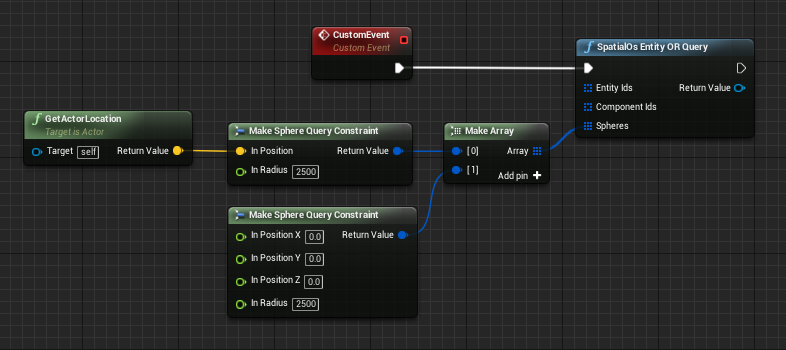
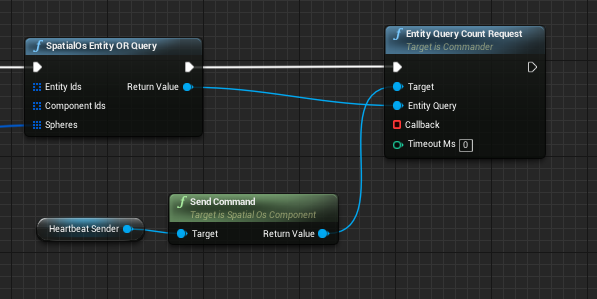
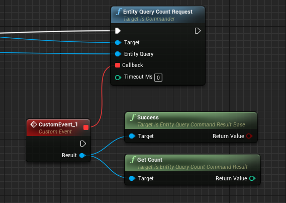
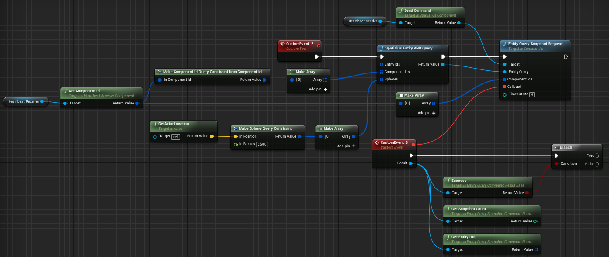

# Querying the world

You can search the SpatialOS world for [entities (SpatialOS documentation)](https://docs.improbable.io/reference/12.2/shared/concepts/entities), using entity queries
and a query language.

This is useful if you want to get information about entities, including entities outside the area of the world that your
[Unreal worker (SpatialOS documentation)](https://docs.improbable.io/reference/12.2/shared/concepts/workers) instance knows about. A query can return entity IDs, so you can
query for entities that you want to [invoke a command on](../interact-with-world/interact-components.md#sending-a-command),
or [delete](../interact-with-world/create-delete-entities.md#deleting-an-entity).

You can currently use the [base C++ SDK (SpatialOS documentation)](https://docs.improbable.io/reference/12.2/cppsdk/using) or Blueprints to create queries. This page gives
a short introduction to queries, but for a fuller reference,
see the [C++ worker API section on Entity queries (SpatialOS documentation)](https://docs.improbable.io/reference/12.2/cppsdk/using#entity-queries).

> In order to send an entity query, a worker must have **permission** to do so.
For more information, see the [Worker permissions (SpatialOS documentation)](https://docs.improbable.io/reference/12.2/shared/worker-configuration/permissions) page.

## Building and sending a query in C++

### Set up the query

It's common to have a single "Spawner" entity in the world's starting snapshot, with a single component `Spawner`.
This entity is responsible for creating a player entity for UnrealClient workers when they connect.

To find this entity from the UnrealClient worker, you would build the following query:

```cpp
const worker::query::EntityQuery& entity_query = {
    worker::query::ComponentConstraint { improbable::spawner::Spawner::ComponentId },
    worker::query::SnapshotResultType {}
};
```

Make sure you include the header files of any components you reference.

### Sending a query

Send a query and listen for the response by directly using the `Connection` and `View` exposed by the C++ SDK. The
connection can be accessed from the `USpatialOS` object.   

To send a query:

```cpp
auto requestId = spatialOS->GetConnection().SendEntityQueryRequest(entity_query, 0));
```

> The example code above assumes that you have access to a pointer to the `USpatialOS`
of your project. In the Unreal Starter Project, this object is stored in the `StarterProjectGameInstance`.

To listen for a response using the `requestId` returned by `SendEntityQueryRequest()`:

```cpp
spatialOS->GetView().OnEntityQueryResponse([this, requestId](const worker::EntityQueryResponseOp& op) {
    if (op.RequestId != requestId)
    {
        return;
    }
    if (op.StatusCode != worker::StatusCode::kSuccess)
    {
        std::string errorMessage = "Could not find spawner entity: " + op.Message;
        // output error
        return;
    }
    if (op.ResultCount == 0)
    {
        std::string errorMessage = "Query returned 0 spawner entities";
        // output error
        return;
    }
    auto spawnerEntityId = op.Result.begin()->first;
    // do something with the spawner's entity ID
});
```

> The example code above assumes that you have access to a pointer to the `USpatialOS`
of your project. In the Unreal Starter Project, this object is stored in the `StarterProjectGameInstance`.

## Building and sending a query in Blueprint

To send an entity query in Blueprint you first need to set up your query.
The query consists of one or more query constraints. These constraints
can be combinations of `EntityId Query Constraint`, `ComponentId Query Constraint`
and `Sphere Query Constraint`. There are helper functions supplied to create these
constraints from `FEntityId`, `FComponentId` or an FVector position and radius.

You can send these queries to either `Entity Query Count Request` (which returns the number of entities that match
the supplied query) or `Entity Query Snapshot Request` (which returns the `FEntityId`’s of the matching entities).
These functions are accessible from the SpatialOS `Commander` class.

### Entity query example

0. Set up your constraints.

    

    This constraint is set up so that it will match any entities in either sphere.

0. Send query request.

    

0. Use the result from the callback.

    


### A more advanced example

In this example we query for entities that are inside a sphere and has a 'HeartbeatReceiver' component.


