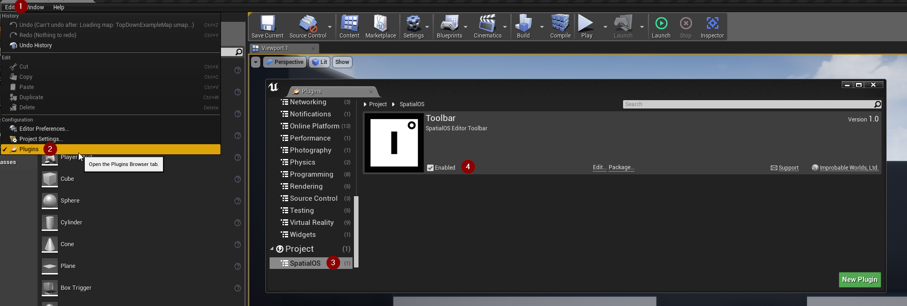
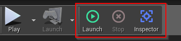
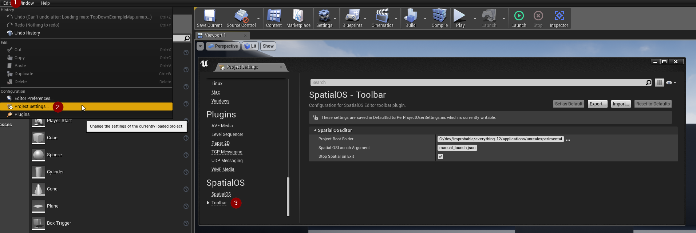

# The Unreal SpatialOS toolbar

The Unreal SpatialOS toolbar is an easy way to run [`spatial` command-line tool (SpatialOS documentation)](https://docs.improbable.io/reference/12.2/shared/glossary#the-spatial-command-line-tool) commands
from inside Unreal. 

## Add the SpatialOS toolbar to your Unreal project

To enable the Unreal SpatialOS toolbar:

0. If you have custom build scripts, add a dependency to `improbable_editor_toolbar_plugin` in worker packages.

    0. Open `spatialos_worker_packages.json` and add the toolbar plugin to the `targets` list:

	    ```
	    "targets": [
	    {
	      "path": "Game/Plugins",
	      "type": "unreal",
	      "packages": [
	        {
	          "name": "improbable_editor_toolbar_plugin"
	        }
	      ]
	    },
	    ```

    0. Run `spatial codegen` to update the worker dependencies and download the plugin.

0. Add a dependency to the plugin in your Unreal project file.

	Either:

	* Open your Unreal project's `.uproject` file in a text editor and add the SpatialOS
	editor toolbar in the `Plugins` section:

	    ```  
	    "Plugins": [
	        {
	            "Name": "SpatialOSEditorToolbar",
	            "Enabled": true
	        }
	    ],
	    
	    ```

	* Or, inside the Unreal Editor, navigate to `Edit > Plugins` and scroll down
	to the bottom. Select the `SpatialOS` section and enable `SpatialOSEditorToolbar`:

		


## SpatialOS toolbar

The Unreal SpatialOS toolbar has three features mapped to individual buttons, and is displayed
in the main editor toolbar to the right of the `Launch` button.

 

* Launch
    
    Runs `spatial local launch` with the launch configuration specified in the settings (see [below](#settings)).

* Stop

    Stops `spatial local launch`.

* Inspector
    
    Opens the [Inspector (SpatialOS documentation)](https://docs.improbable.io/reference/12.2/shared/glossary#inspector) in a browser.

## Settings

The toolbar settings are in `Edit > Project Settings > Improbable > SpatialOSEditorToolbar`.

 

* Project Root Folder
    
    By default, this points to the root folder of your SpatialOS project. If you're using a non-standard structure, you'll need to set this yourself. 

* SpatialOS Launch Argument

    The [launch configuration file (SpatialOS documentation)](https://docs.improbable.io/reference/12.2/shared/reference/file-formats/launch-config) to use when running `spatial local launch` using the `Launch` button.

* Stop SpatialOS on Exit

    If enabled, shuts down running deployments when you close the Unreal editor.

