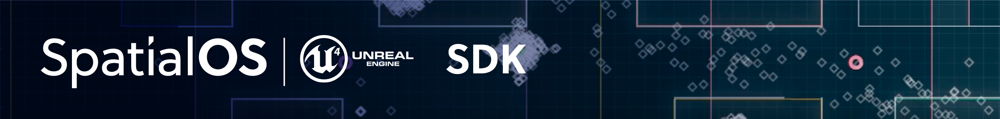

### Welcome to the SpatialOS Unreal SDK documentation

**New to the platform?** You can read [what SpatialOS is (SpatialOS  documentation)](https://docs.improbable.io/reference/13.0/shared/concepts/spatialos) .

**Need some help?** Join us at [forums.improbable.io](https://forums.improbable.io) for technical questions and issues.

 **Note**:
SpatialOS 13 is fine for local development and deployments using the `small`
 [deployment template (SpatialOS documentation)](https://docs.improbable.io/reference/13.0/shared/reference/file-formats/launch-config#templates), but deployments using larger templates may be unstable.

**License:** See the [license](../LICENSE.md).

### Installing and upgrading
* If you are installing SpatialOS and the SpatialOS Unreal SDK for the first time, see:
[Introduction to the Unreal SDK](introduction.md).
* If you have a version of SpatialOS and the SpatialOS Unreal SDK which is earlier than SpatialOS 13.0,
you have a combined SpatialOS and SpatialOS Unreal SDK bundle. To get the separated version, see
[Upgrading to SpatialOS 13.0 and migrating to the Unreal SDK 1.0.0](migration.md).

## Documentation contents
### Get started
- [Introduction to the Unreal SDK](introduction.md)
- Setup guide - [Windows](get-started/setup/win.md)
- [System requirements](get-started/requirements.md)
- [Basics tutorial](get-started/unreal-basics-tutorial/lesson1.md)
#### Development process
- [Setting up a project](develop/set-up-unreal-project.md)
- [Building](develop/build.md)
- [Running your project](develop/debug-and-iterate.md)
### Interacting with the world
- [Creating entity blueprints](interact-with-world/entity-blueprints.md)
- [Creating and deleting entities](interact-with-world/create-delete-entities.md)
- [Querying the world](interact-with-world/query-world.md)
- [Interacting with entity components](interact-with-world/interact-components.md)
###  Configuration
- [Setting up an Unreal worker](configuration/worker-setup.md)
- [Changing the starting state](configuration/change-snapshot.md)
- [Entity pipeline](configuration/entity-pipeline.md)
### Reference
- [SpatialOS toolbar](reference/spatialos-toolbar.md)
- [Unreal worker structure](reference/unreal-worker-structure.md)
- [Worker configuration](reference/worker-configuration.md)
- [Starter projects and repos](repositories.md)
###  Releases
- [Release notes](releases/release-notes.md)
